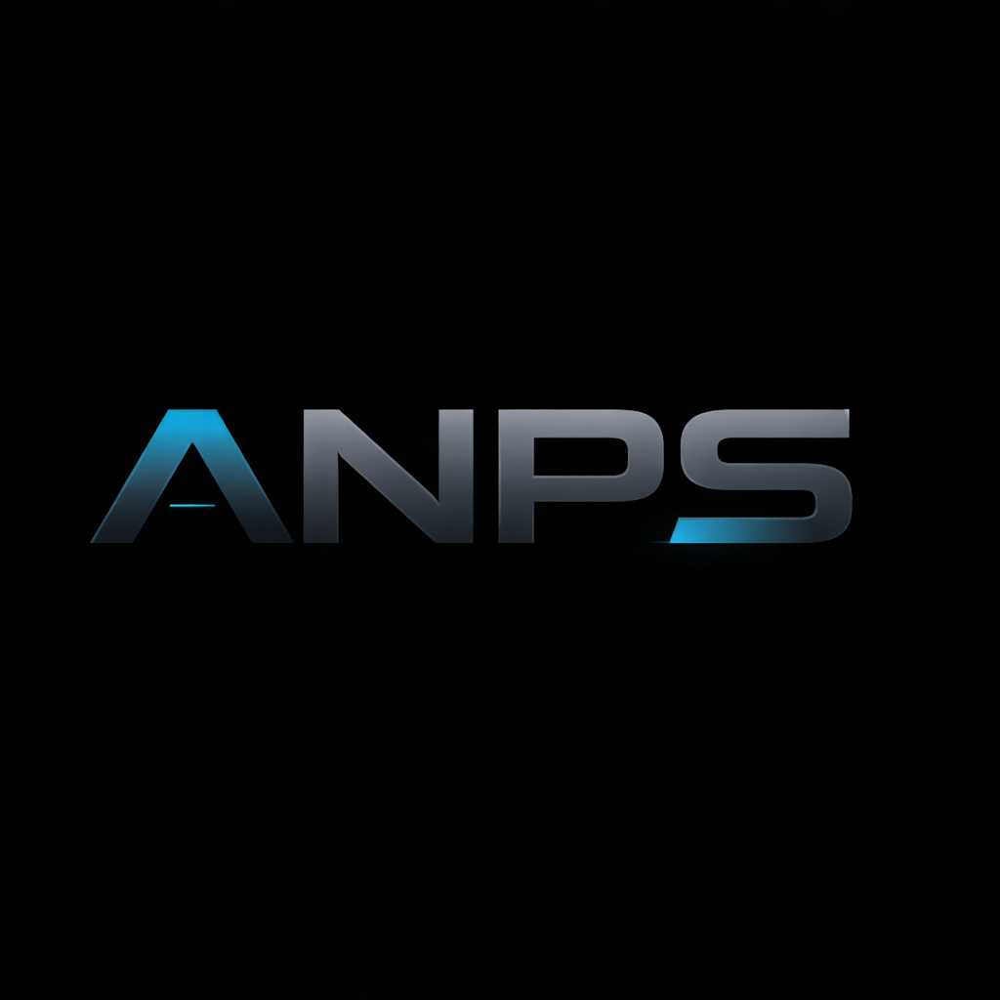
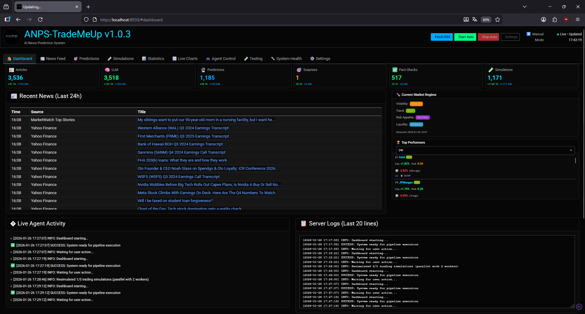
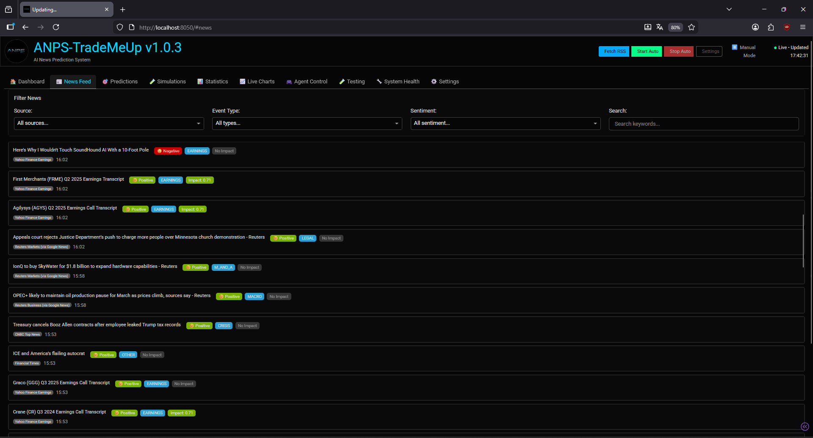
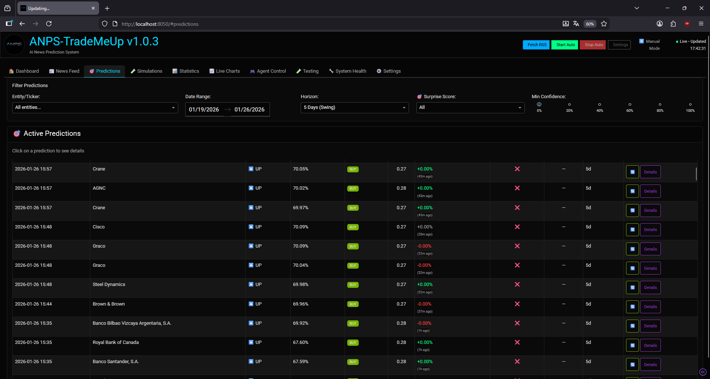
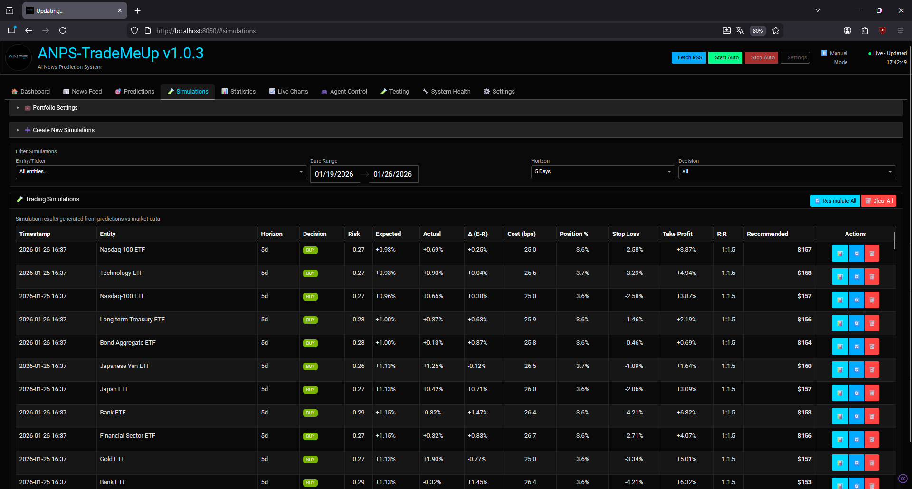
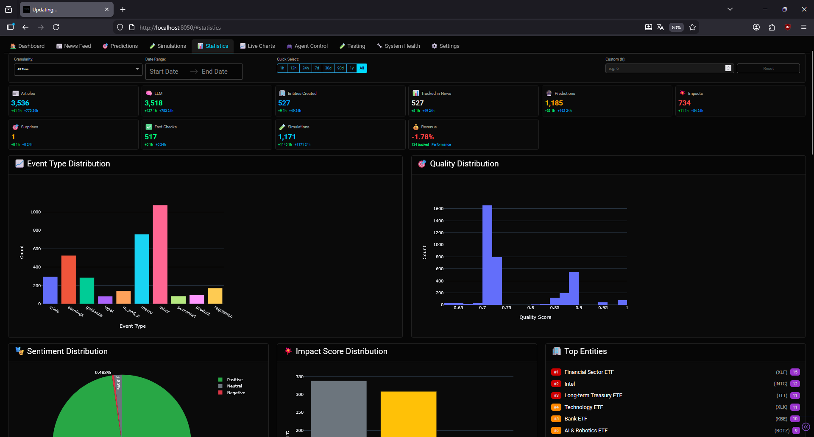
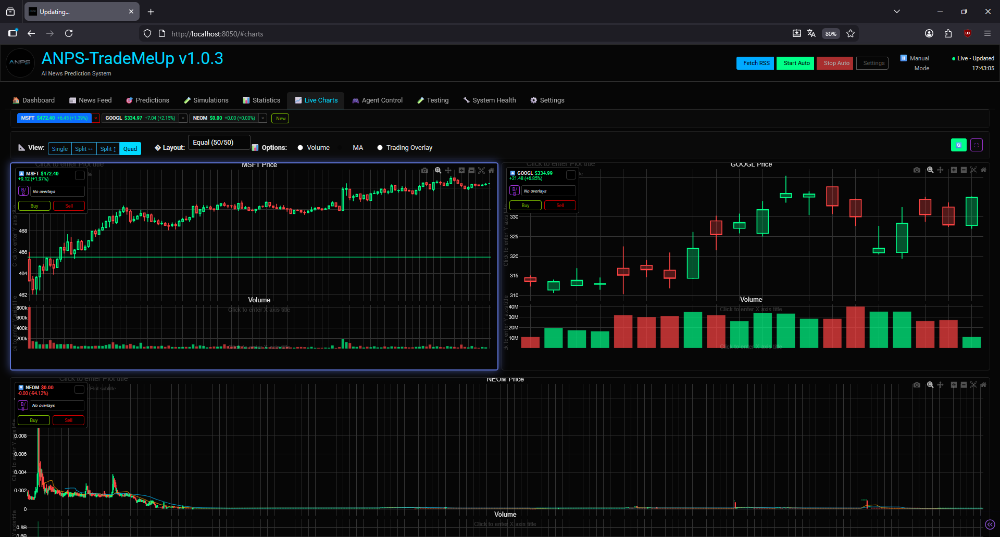

<br/>

  
  
  
  
  
    
<br/>

<div align="left">
  
</div>

# ANPS-TradeMeUp

## **ANPS (AI News Prediction System) - Multi-Agent News-Based Market Prediction System**

> **Note:** This is a private, source-available project currently under active development. Features, APIs, and screenshots may change frequently and are not intended for production use. ⚠️

### What is ANPS-TradeMeUp?

ANPS-TradeMeUp (AI News Prediction System) is an MVP-grade pipeline that ingests news, extracts events/entities using LLMs, scores impact and surprise, and produces short-to-medium term market predictions. It includes a Dash GUI for real-time monitoring and a FastAPI backend.










---

## Quick Start

TradeMeUp converts financial news into probabilistic market predictions using a modular multi-agent pipeline. Start the GUI quickly with `start_gui.bat` (Windows) and explore dashboards and live charts. For development and production setup, follow the **Installation** section below.

---

## Features

### Multi-Agent Pipeline
- 16-agent modular architecture (ingest → understand → analyse → predict)
- LLM-based content understanding with fact verification
- Entity mapping with confidence scoring
- Impact, surprise, and regime detection
- Signal decay tracking and correlation analysis
- Multi-horizon predictions (1d, 5d, 20d)

### Dashboard
- Real-time metrics overview (news volume, predictions, entities)
- Recent news feed with quality scores
- Current market regime indicator
- Top performers tracking (1h, 24h, 5d, 30d, 1y, all-time)
- Pipeline health monitoring

### Predictions Tab
- Advanced filtering (entity, date range, horizon, confidence)
- Live performance tracking with actual vs expected returns
- Direction probabilities (up/down/flat)
- Risk and confidence scores
- Detailed modal view with market data
- Refresh individual predictions
- Export and batch operations

### Trading Simulations
- Portfolio configuration (capital, currency, risk adjustment)
- Create simulations from predictions (date range or last N)
- Trading decisions (buy/sell/hold) with risk assessment
- Stop loss and take profit calculations
- Transaction cost breakdown (commission, spread, slippage, market impact)
- Position sizing recommendations (risk-adjusted)
- Penny stock detection with special cost handling
- Expected vs actual return tracking
- Resimulate all with latest market data
- Filter by entity, horizon, decision, date range

### Statistics Tab
- Overall metrics (articles, entities, predictions, impact scores)
- Event and quality distribution charts
- Sentiment analysis (positive/negative/neutral)
- Impact score visualization
- Top entities rankings
- Entity sentiment analysis with timeframes (7d, 30d, 90d, all)
- Entity details table with search
- News volume trends over time

### Live Charts
- Multi-panel chart view (single, dual, quad mode)
- Candlestick and line chart types
- Real-time price updates (30s interval)
- Multiple timeframes (1d, 5d, 1mo, 3mo, 6mo, 1y, 2y, 5y, max)
- Volume overlay and moving averages
- Infinite scroll for historical data
- Zoom and pan with state persistence
- Fullscreen mode
- Chart overlays (brackets, breakouts) - DB-backed
- Custom symbol search

### Agent Testing
- Individual agent health checks
- Test all 16 agents independently
- Real-time status monitoring
- Error tracking and logging
- Agent performance metrics

### System Health
- Pipeline status overview
- Database statistics
- Agent operational status
- Processing metrics
- Activity log monitoring

---

## Quick Start
1. Clone:
   ```bash
   git clone https://github.com/arn-c0de/ANPS-TradeMeUp.git
   cd ANPS-TradeMeUp
   ```
2. Create an environment file and add API keys:
   ```bash
   cp .env.example .env
   # edit .env
   ```
3. Start the GUI (Windows):
   ```powershell
   .\start_gui.bat
   # open http://localhost:8050
   ```

That's enough to explore the GUI and view sample dashboards. For a full development environment and pipeline run, continue with the Installation below.

---

## Installation & Full Setup
Prerequisites:
- Python 3.11+
- Poetry (recommended)

> **Note:** Docker & Docker Compose are currently not available in this distribution. Local infra services (Postgres, Redis, MinIO) may be unavailable; configure remote services or proceed without them and expect limited functionality.

Full steps:
1. Infrastructure services (Docker not available):
   > **Note:** Docker & Docker Compose are currently unavailable. If you have access to infrastructure elsewhere (cloud/staging), set `DATABASE_URL`, `REDIS_URL`, and `MINIO` accordingly. Otherwise skip this step; some features will be limited.
2. Install Python dependencies (using Poetry):
   ```bash
   poetry install
   poetry shell
   ```
3. Copy environment template and configure keys:
   ```bash
   cp .env.example .env
   # add Anthropic/OpenAI, AlphaVantage or other keys
   ```
4. Run DB migrations:
   ```bash
   alembic upgrade head
   ```
5. Run the pipeline:
   - Continuous mode (recommended):
     ```bash
     python scripts/run_continuous_pipeline.py
     ```
   - One-shot (single pass):
     ```bash
     python scripts/run_mvp_pipeline.py
     ```
6. Start the API (optional):
   ```bash
   uvicorn src.api.main:app --reload
   # open http://localhost:8000/docs
   ```

---

## Development Notes & Project Status
- **Phase:** Phase 1 - MVP Core
- **Progress:** 16 of 17 agents implemented (active development)
- Recent: GUI improvements, central error handling, and added agent init tests.

Full implementation details, architecture, and agent breakdown are available deeper in this README and in `docs/`.

---

## Documentation & Guides
- Quickstart: `QUICKSTART.md`
- GUI docs: `docs/GUI_README.md`
- Local setup: `docs/SETUP_LOCAL.md`
- Performance: `docs/CONTINUOUS_PIPELINE_PERFORMANCE.md`
- Third-party licenses: `THIRD_PARTY_LICENSES.md`

---

## Contributing & Tests
- Run unit tests:
  ```bash
  pytest tests/unit
  ```
- Integration tests:
  ```bash
  pytest tests/integration
  ```

Please follow the development workflow in [CONTRIBUTING.md](CONTRIBUTING.md).

---

## Security

If you discover a security vulnerability, please do not file a public issue. Report it by email to `arn-c0de@protonmail.com` or via GitHub Security Advisories at `https://github.com/arn-c0de/ANPS-TradeMeUp/security`. Include steps to reproduce, affected versions, and an assessment of potential impact where possible. The maintainer will acknowledge receipt within 3 business days.

See [SECURITY.md](SECURITY.md) for detailed security policy and best practices.

---

## License
Copyright (c) 2026 arn-c0de. All rights reserved.

**PROPRIETARY SOURCE-AVAILABLE LICENSE**

This software is proprietary and source-available. You may view, clone, and modify this repository solely for the purpose of contributing improvements via pull requests or issues.

**Strictly prohibited without explicit written permission:**
- Commercial use
- Redistribution
- Publication of modified or unmodified versions
- Use in other software projects
- Sublicensing or selling

All contributions submitted to this repository become the exclusive property of the copyright holder.

See [LICENSE](LICENSE) for full details.

**Maintainer:** `arn-c0de` (<arn-c0de@protonmail.com>)  
**Repository:** `https://github.com/arn-c0de/ANPS-TradeMeUp`

---

**Last Updated:** January 26, 2026
**Version:** 1.0.4

Developer note: When updating the project version, please also update the `VERSION` constant in `src/config/settings.py` so the GUI and documentation reflect the correct version.
