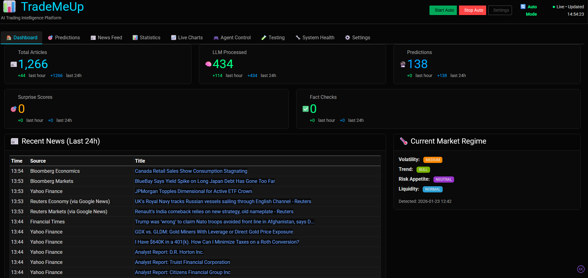
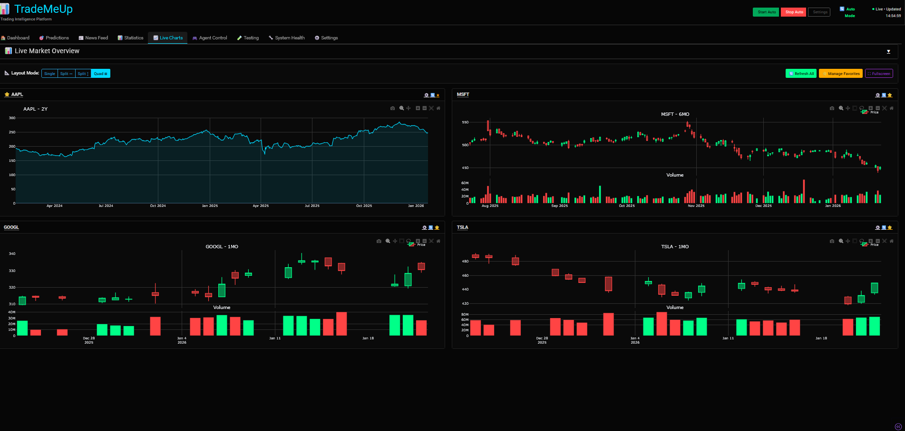
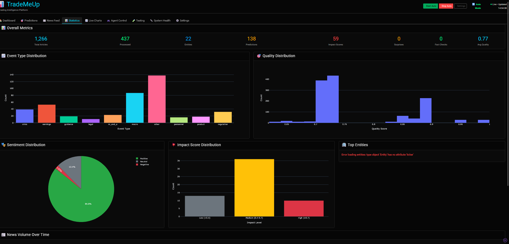
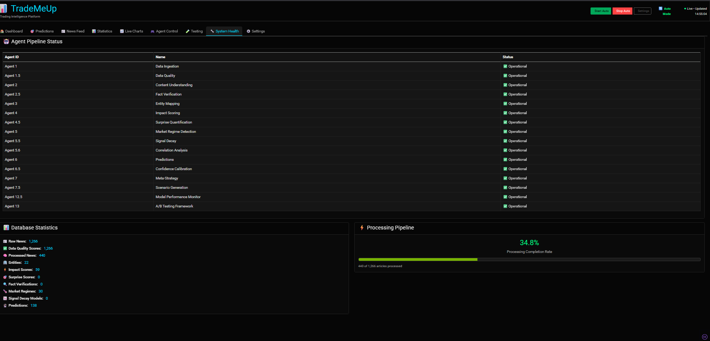

# TradeMeUp 🚀

**AI Multi-Agent News-Based Market Prediction System**






---

## Quick TL;DR (for new users) ✅
- TradeMeUp converts financial news into probabilistic market predictions using a modular multi-agent pipeline.
- Start the GUI quickly with `start_gui.bat` (Windows) and explore dashboards & live charts.
- For development and production setup, follow the **Installation** section further down.

---

## What is TradeMeUp? 💡
TradeMeUp is an MVP-grade pipeline that ingests news, extracts events/entities using LLMs, scores impact & surprise, and produces short-to-medium term market predictions. It includes a Dash GUI for real-time monitoring and a FastAPI backend.

## Highlights & Quick Features ✨
- Modular multi-agent architecture (ingest → understand → analyse → predict)
- LLM-based content understanding + entity/ticker mapping
- Impact, surprise, and regime scoring
- XGBoost prediction baseline with multi-horizon forecasts
- Dash GUI: Dashboard, Live Charts, Agent Control, System Health

---

## Screenshots 📸
- Main dashboard (news, metrics, market regime)
- Live charts (multi-ticker, multi-horizon)
- Statistics & health pages

(See images in `images/screenshots/`)

---

## Quick Start (3 steps) ⚡
1. Clone:
   ```bash
   git clone https://github.com/arn-c0de/TradeMeUp.git
   cd TradeMeUp
   ```
2. Create an environment file and add API keys:
   ```bash
   cp .env.example .env
   # edit .env
   ```
3. Start the GUI (Windows):
   ```powershell
   .\start_gui.bat
   # open http://localhost:8050
   ```

That's enough to explore the GUI and view sample dashboards. For a full development environment and pipeline run, continue with the Installation below.

---

## Installation & Full Setup (Detailed) 🔧
Prerequisites:
- Python 3.11+
- Docker & Docker Compose
- Poetry (recommended)

Full steps:
1. Start infra services (optional, but recommended for full functionality):
   ```bash
   docker-compose up -d
   ```
2. Install Python dependencies (using Poetry):
   ```bash
   poetry install
   poetry shell
   ```
3. Copy environment template and configure keys:
   ```bash
   cp .env.example .env
   # add Anthropic/OpenAI, AlphaVantage or other keys
   ```
4. Run DB migrations:
   ```bash
   alembic upgrade head
   ```
5. Run the pipeline:
   - Continuous mode (recommended):
     ```bash
     python scripts/run_continuous_pipeline.py
     ```
   - One-shot (single pass):
     ```bash
     python scripts/run_mvp_pipeline.py
     ```
6. Start the API (optional):
   ```bash
   uvicorn src.api.main:app --reload
   # open http://localhost:8000/docs
   ```

---

## Development Notes & Project Status 🧭
- **Phase:** Phase 1 - MVP Core
- **Progress:** 16 of 17 agents implemented (active development)
- Recent: GUI improvements, central error handling, and added agent init tests.

Full implementation details, architecture, and agent breakdown are available deeper in this README and in `docs/`.

---

## Documentation & Guides 📚
- Quickstart: `QUICKSTART.md`
- GUI docs: `docs/GUI_README.md`
- Local setup: `docs/SETUP_LOCAL.md`
- Performance: `docs/CONTINUOUS_PIPELINE_PERFORMANCE.md`

---

## Contributing & Tests 🧪
- Run unit tests:
  ```bash
  pytest tests/unit
  ```
- Integration tests:
  ```bash
  pytest tests/integration
  ```

Please follow the development workflow in `CONTRIBUTING.md` (add if missing).

---

## Security
If you discover a security vulnerability, please do not file a public issue. Report it by email to `arn-c0de@protonmail.com` or via GitHub Security Advisories at `https://github.com/arn-c0de/TradeMeUp/security`. Include steps to reproduce, affected versions, and an assessment of potential impact where possible. The maintainer will acknowledge receipt within 3 business days.

---

## License
Copyright (c) 2026 arn-c0de. All rights reserved.

Maintainer: `arn-c0de` (<arn-c0de@protonmail.com>)
Repository: `https://github.com/arn-c0de/TradeMeUp`

This is proprietary software. Unauthorized use, copying, modification, or distribution is strictly prohibited. See [LICENSE](LICENSE) for details.

---

**Last Updated:** January 23, 2026
**Version:** 1.0.2

Developer note: When updating the project version, please also update the `VERSION` constant in `src/config/settings.py` so the GUI and documentation reflect the correct version.
