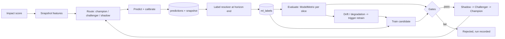

# Adaptive ML Learning Loop — deep integration plan

Status: proposal / idea plan. Nothing here is implemented yet.
Target version: 1.0.6 (schema + loop), 1.1.x (routing, online adaptation).
Companion document: [`1.0.5-Domain-Modularization-Plan.md`](1.0.5-Domain-Modularization-Plan.md)
— every table and interface below is deliberately domain-neutral so the same
machinery serves the `trading` pack and a future `cybersec` pack unchanged.

---

## 1. Goal

Make the predictions the system produces **measurably better the longer the system
runs**, without a human in the loop, by turning the database into the single
abstract substrate for the whole ML lifecycle:

```
predict → snapshot the exact inputs → resolve the outcome at the horizon
        → evaluate → retrain → shadow → challenge the champion → promote → monitor
```

"Deep integration" here means three concrete commitments:

1. **The model is data, not a file.** A model version is a row with an artifact,
   a feature-set contract, metrics, and a lifecycle state — not `models/xgboost_v1.0.pkl`.
2. **Every prediction carries its own reproducible training sample.** The features
   that produced a prediction are stored *at prediction time*; the label is
   attached later by a resolver. Retraining never reconstructs history from
   mutable current state.
3. **Promotion is automatic and evidence-based.** A new model only serves traffic
   after it beat the incumbent out-of-sample *and* in shadow mode, on the same
   labelled slice.

Non-goals: real-time streaming ML, GPU training, deep learning on raw text,
replacing the LLM analysis stages. This plan makes the *existing* signal chain
self-improving; it does not add new signal sources.

---

## 2. Why the system cannot improve today

An honest audit of the current path. These are not style complaints — each one
independently prevents learning, and several would make a naive retraining loop
learn noise and then confidently serve it.

### 2.1 The model is a pickle on a bind mount

`src/agents/prediction_agent.py:112` loads `{MODEL_PATH}/{model_version}.pkl`
via `pickle.load`. `scripts/train_prediction_model.py:160` writes it with a
plain `open(..., 'wb')`.

- No atomic write and no checksum: a pipeline iteration that rebuilds the agent
  (`build_agent` in `src/agents/__init__.py:38` constructs a fresh
  `PredictionAgent` per phase run, so the file is re-read every iteration) can
  read a half-written model.
- No provenance. Nothing records which feature set, date window, hyper-parameters
  or code revision produced the artifact.
- `./models:/app/models` (`docker-compose.yml:45`) is a single-host bind mount.
  Model state lives outside the database, so it is outside backup, outside
  migration, and invisible to the GUI.
- `pickle` of an `XGBClassifier` is version-fragile and is an arbitrary-code
  execution sink on load.

### 2.2 There is no record of what a prediction actually saw

`FeatureEngineer.extract_features_for_prediction` (`src/ml/feature_engineering.py:34`)
computes 22 features from live table state and throws them away after the
prediction row is written. `create_training_dataset` (line 179) recomputes them
later from *current* state.

Consequences:

- **Training/serving skew.** Impact scores, sentiment, and regime rows can be
  backfilled or corrected after the fact (`scripts/backfill_all_agents.py` does
  exactly that). The training row is then not what the served model saw.
- **Silent leakage.** `MarketRegime.timestamp <= as_of_date` is point-in-time,
  but `ImpactScore`/`ProcessedNews` are looked up by id with no `valid_from`
  guard, so a later revision of an article's sentiment leaks backwards.
- **No feature versioning.** `get_feature_names()` (line 350) is a hardcoded
  list. Adding a feature silently invalidates every model on disk: the vector in
  `_predict_with_model` (line 228) is built by name order, so an old model gets
  a differently-shaped/ordered input with no error.

### 2.3 The labels are wrong for the task

This is the most damaging item. `PredictionPerformanceService.get_prediction_performance`
(`src/services/prediction_performance_service.py:69`) computes
`total_return = (current_price - prediction_price) / prediction_price` — i.e.
**from prediction date until now**, and never reads `prediction.horizon`.

- A `1d`, a `5d` and a `20d` prediction for the same article get the *identical*
  realised return. The three horizons are therefore statistically indistinguishable,
  and any model trained on them learns one blended target.
- The outcome is overwritten on every evaluation pass (`save_prediction_performance`
  updates in place), so a "resolved" outcome keeps drifting with the market
  instead of freezing at horizon end.
- Meanwhile `FeatureEngineer._forward_return` (line 306) computes a *correct*,
  horizon-aware, no-look-ahead label from price history — but as a decimal
  fraction, while `PredictionOutcome.actual_return` is a percentage
  (`src/utils/prediction_math.py:23` is explicit about this). Two sources of
  truth, two unit conventions, disagreeing by a factor of 100.

Everything downstream inherits this: `ModelPerformanceMonitor`, `ABTestingAgent`,
`ConfidenceCalibrationAgent` and `MetaStrategyAgent` all score against
`outcome.actual_return`.

### 2.4 The training set is capped at 100 rows

`FeatureEngineer.MAX_TRAINING_SAMPLES = 100` (line 20). With a chronological
80/20 split that is 20 evaluation samples across a 3-class target. The
"majority baseline" guard in `scripts/train_prediction_model.py:140` is the only
thing standing between that and a promoted model — and it only logs a warning.

More data cannot help while this cap exists, which is precisely the "gets better
over time" property we want.

### 2.5 Feedback is computed and then discarded

- `BacktestResult` (`src/models/predictions.py:105`) is **never written** by any
  code path — only read by the DB browser tab (`src/gui/tabs/databases.py:70`).
- `MetaStrategyAgent.calculate_model_weights` recomputes accuracy-based weights
  on every batch and keeps them in `self._model_weights` (in-memory, per process).
  They are embedded in an ensemble row's `model_contributions` and otherwise lost.
- `ConfidenceCalibrationAgent` writes `calibrated_confidence` back onto the
  prediction row, but the calibration map itself is never persisted, never
  versioned, and never applied at *generation* time — `PredictionAgent` writes
  raw `confidence` and only the simulator later prefers the calibrated value
  (`src/simulations/trading_simulator.py:693`).
- `ABTestingAgent.create_ab_test` stores tests in `self._active_tests` — a dict
  that dies with the process. `analyze_ab_test` compares two `model_version`
  strings that were never assigned by a traffic split, because only one model is
  ever loaded.

So: the system already *measures* itself competently. It just has nowhere to put
the measurements, and no mechanism that consumes them.

### 2.6 Summary

| Capability | Today | Needed |
| --- | --- | --- |
| Model artifact storage | pickle on bind mount | registry row + versioned artifact in DB |
| Feature provenance | none | point-in-time snapshot per prediction |
| Feature schema | hardcoded list | versioned feature-set contract |
| Label | horizon-blind, mutable, wrong units | horizon-resolved, immutable, one unit |
| Training data volume | 100 rows | all labelled snapshots, windowed |
| Training trigger | manual CLI | scheduled pipeline phase |
| Model comparison | ad-hoc, in-memory | persisted experiments + shadow scoring |
| Promotion | copy a file | gated state transition, audited |
| Calibration | recomputed, unversioned | versioned artifact applied at serve time |
| Drift detection | accuracy delta only | feature + label + performance drift |

---

## 3. Design principles

1. **Domain-neutral by construction.** No ML table names a ticker, a price, or a
   return. The prediction target is `(target_name, horizon, label_space)`; the
   trading pack instantiates it as `("direction", "5d", ["up","flat","down"])`,
   a cyber pack as `("exploited_in_wild", "30d", ["yes","no"])`.
2. **The database is the interface.** Training, serving, evaluation and the GUI
   communicate through tables, never through a shared filesystem or process
   memory. This is what makes the worker, the API and a future training job
   independently schedulable.
3. **Point-in-time or it did not happen.** A row that cannot state *what was
   knowable at `as_of`* is not eligible for training.
4. **Append-only for anything a model learns from.** Snapshots and resolved
   labels are immutable. Corrections create a new row with a new `valid_from`.
5. **The heuristic is a model.** `HEURISTIC_MODEL_VERSION` becomes a registered
   model with a lifecycle state, so it can be A/B-tested, out-competed, and
   retired by the same machinery — and so a champion that stops beating it is
   automatically detected.
6. **Fail closed.** No labelled data, failed gate, feature-set mismatch, stale
   artifact → serve the incumbent (ultimately the heuristic), never an
   unvalidated model.
7. **Storage layer is swappable.** All ML persistence goes through a `MLStore`
   protocol with a PostgreSQL implementation. A later move to a dedicated feature
   store does not touch agent code.

---

## 4. Target data model

New module `src/models/ml.py`, one Alembic revision per logical group. All tables
use the existing `GUID` type (`src/models/types.py`) and `utc_now`, and JSONB for
open payloads — consistent with `src/models/predictions.py`.

### 4.1 Feature contract

```python
class FeatureSet(Base):
    """A named, versioned, ordered feature contract."""
    __tablename__ = "ml_feature_sets"

    feature_set_id = Column(GUID, primary_key=True, default=uuid.uuid4)
    name          = Column(String(100), nullable=False)   # "news_impact_v1"
    version       = Column(Integer, nullable=False)       # bumped on any change
    domain        = Column(String(50), nullable=False, default="trading")
    schema        = Column(JSONB, nullable=False)         # [{name, dtype, default, nullable}]
    schema_hash   = Column(String(64), nullable=False)    # sha256 of the ordered schema
    created_at    = Column(DateTime(timezone=True), nullable=False, default=utc_now)

    __table_args__ = (UniqueConstraint("name", "version"),)
```

The ordered `schema` replaces `FeatureEngineer.get_feature_names()`. Vector
assembly is driven by the *model's own* feature set, so an old model keeps
receiving the vector it was trained on even after new features are added.
`schema_hash` mismatch at serve time is a hard error, not a silent misprediction.

### 4.2 Feature snapshot (the point-in-time store)

```python
class FeatureSnapshot(Base):
    """Exactly the inputs one prediction was computed from."""
    __tablename__ = "ml_feature_snapshots"

    snapshot_id    = Column(GUID, primary_key=True, default=uuid.uuid4)
    feature_set_id = Column(GUID, ForeignKey("ml_feature_sets.feature_set_id"), nullable=False)
    domain         = Column(String(50), nullable=False, default="trading")
    entity_id      = Column(String(50), ForeignKey("entities.entity_id"), nullable=False)
    source_ref     = Column(GUID)          # news_id — the event that triggered it
    as_of          = Column(DateTime(timezone=True), nullable=False)  # knowledge cutoff
    features       = Column(JSONB, nullable=False)
    feature_hash   = Column(String(64), nullable=False)  # dedupe identical snapshots
    group_key      = Column(String(120))   # story/cluster id — see §7.4 (leakage)
    created_at     = Column(DateTime(timezone=True), nullable=False, default=utc_now)

    __table_args__ = (
        Index("idx_snapshot_entity_asof", "entity_id", "as_of"),
        Index("idx_snapshot_set_asof", "feature_set_id", "as_of"),
        UniqueConstraint("feature_set_id", "entity_id", "source_ref", "as_of"),
    )
```

`Prediction` gains `snapshot_id` (nullable FK) so a prediction is joinable to its
own inputs. One snapshot serves all three horizons of the same article/entity —
the horizon lives on the label, not on the features.

> **Volume note.** ~22 float features as JSONB ≈ 600–900 B/row. At the current
> pipeline rate (batch 50, per iteration) this is single-digit GB per year worst
> case. Retention and partitioning: §12.

### 4.3 Labels (the ground truth)

```python
class PredictionLabel(Base):
    """Immutable realised outcome for one (snapshot, target, horizon)."""
    __tablename__ = "ml_labels"

    label_id     = Column(GUID, primary_key=True, default=uuid.uuid4)
    snapshot_id  = Column(GUID, ForeignKey("ml_feature_snapshots.snapshot_id"), nullable=False)
    target_name  = Column(String(50), nullable=False)   # "direction"
    horizon      = Column(String(10), nullable=False)   # "1d" | "5d" | "20d"

    label_class  = Column(String(20))       # "up" | "flat" | "down"
    label_value  = Column(Float)            # realised return, ALWAYS a fraction
    resolved_at  = Column(DateTime(timezone=True), nullable=False)  # horizon end
    entry_ref    = Column(DateTime(timezone=True))  # bar used as entry
    exit_ref     = Column(DateTime(timezone=True))  # bar used as exit
    resolver     = Column(String(50), nullable=False)  # "price_forward_return_v1"
    sample_weight = Column(Float, nullable=False, default=1.0)
    created_at   = Column(DateTime(timezone=True), nullable=False, default=utc_now)

    __table_args__ = (
        UniqueConstraint("snapshot_id", "target_name", "horizon"),
        Index("idx_labels_resolved", "target_name", "horizon", "resolved_at"),
    )
```

Written **once**, when the horizon has actually elapsed. `label_value` is a
decimal fraction everywhere; the percentage convention stays confined to the
presentation layer and `src/utils/prediction_math.py`.

`PredictionOutcome` is kept as-is for the GUI ("how is my prediction doing right
now?" is a legitimate, different question — it is a *live* view, not a label) but
is explicitly documented as non-training data.

### 4.4 Model registry

```python
class MLModel(Base):
    __tablename__ = "ml_models"

    model_id       = Column(GUID, primary_key=True, default=uuid.uuid4)
    model_key      = Column(String(100), nullable=False)  # "direction_5d"
    version        = Column(String(50), nullable=False)   # "xgboost_2026_07_29_01"
    domain         = Column(String(50), nullable=False, default="trading")
    target_name    = Column(String(50), nullable=False)
    horizon        = Column(String(10), nullable=False)
    algorithm      = Column(String(50), nullable=False)   # "xgboost" | "logistic" | "heuristic"
    feature_set_id = Column(GUID, ForeignKey("ml_feature_sets.feature_set_id"))
    hyperparams    = Column(JSONB)
    label_map      = Column(JSONB)        # {"0":"down","1":"flat","2":"up"} — no more guessing
    status         = Column(String(20), nullable=False, default="candidate")
    # candidate → shadow → challenger → champion → retired | rejected
    artifact       = Column(LargeBinary)  # the serialized model itself
    artifact_format= Column(String(20))   # "xgboost_json" | "joblib" | "none"
    artifact_hash  = Column(String(64))
    code_revision  = Column(String(40))   # git sha of the trainer
    trained_at     = Column(DateTime(timezone=True))
    promoted_at    = Column(DateTime(timezone=True))
    retired_at     = Column(DateTime(timezone=True))
    notes          = Column(JSONB)

    __table_args__ = (
        UniqueConstraint("model_key", "version"),
        Index("idx_models_serving", "domain", "model_key", "status"),
    )
```

Decisions worth stating explicitly:

- **Artifact in the DB (`LargeBinary`)**, not on the bind mount. It makes the
  model part of `pg_dump`, removes the single-host assumption, and gives atomic
  publication for free (a row is visible or it is not). Serving keeps a local
  disk cache keyed by `artifact_hash`, so the blob is read once per version.
  XGBoost artifacts are ~1–5 MB; a `bytea` column is comfortable at that size.
- **`artifact_format = "xgboost_json"`** via `Booster.save_model()`, not pickle.
  Version-portable and not an RCE sink. `joblib` only for sklearn preprocessing
  steps, loaded exclusively from our own DB.
- **The heuristic is registered** with `algorithm="heuristic"`,
  `artifact_format="none"` and `status="champion"` on a fresh install. Nothing
  special-cases it.
- `label_map` on the row removes the `CLASS_LABEL_ALIASES` guessing in
  `prediction_agent.py:64` and the "assume [down, flat, up]" fallback at line 205.

### 4.5 Training runs and dataset manifests

```python
class TrainingRun(Base):
    __tablename__ = "ml_training_runs"

    run_id          = Column(GUID, primary_key=True, default=uuid.uuid4)
    model_id        = Column(GUID, ForeignKey("ml_models.model_id"))
    trigger         = Column(String(30), nullable=False)  # "scheduled"|"manual"|"drift"|"degradation"
    window_start    = Column(DateTime(timezone=True), nullable=False)
    window_end      = Column(DateTime(timezone=True), nullable=False)
    split_strategy  = Column(JSONB, nullable=False)  # {"kind":"chronological","test":0.2,"embargo_days":20}
    sample_counts   = Column(JSONB, nullable=False)  # {"total":n,"train":n,"test":n,"per_class":{...}}
    metrics         = Column(JSONB)      # holdout metrics + baselines
    gate_results    = Column(JSONB)      # every gate, its threshold, pass/fail
    status          = Column(String(20), nullable=False)  # running|succeeded|failed|rejected
    error           = Column(String(500))
    started_at      = Column(DateTime(timezone=True), nullable=False, default=utc_now)
    finished_at     = Column(DateTime(timezone=True))


class TrainingSample(Base):
    """Manifest: exactly which labels went into which run, and on which side."""
    __tablename__ = "ml_training_samples"

    run_id   = Column(GUID, ForeignKey("ml_training_runs.run_id"), nullable=False)
    label_id = Column(GUID, ForeignKey("ml_labels.label_id"), nullable=False)
    split    = Column(String(10), nullable=False)  # "train" | "test" | "embargoed"

    __table_args__ = (PrimaryKeyConstraint("run_id", "label_id"),)
```

The manifest is what makes a result *reproducible* rather than merely repeatable:
re-running a run id must give a bit-identical artifact given the same code revision
and seed. It is also the audit trail when a model turns out to have learned
something absurd.

### 4.6 Evaluation, calibration, routing

```python
class ModelMetric(Base):
    """Rolling evaluation of a served model on a slice."""
    __tablename__ = "ml_model_metrics"

    metric_id    = Column(GUID, primary_key=True, default=uuid.uuid4)
    model_id     = Column(GUID, ForeignKey("ml_models.model_id"), nullable=False)
    window_start = Column(DateTime(timezone=True), nullable=False)
    window_end   = Column(DateTime(timezone=True), nullable=False)
    slice_key    = Column(JSONB, nullable=False)  # {"horizon":"5d","regime":"high_vol"} | {}
    metrics      = Column(JSONB, nullable=False)  # accuracy, log_loss, brier, ece, rmse, sharpe, n
    computed_at  = Column(DateTime(timezone=True), nullable=False, default=utc_now)

    __table_args__ = (Index("idx_metrics_model_window", "model_id", "window_end"),)


class ModelCalibration(Base):
    """Versioned confidence mapping, applied at serve time."""
    __tablename__ = "ml_calibrations"

    calibration_id = Column(GUID, primary_key=True, default=uuid.uuid4)
    model_id       = Column(GUID, ForeignKey("ml_models.model_id"), nullable=False)
    method         = Column(String(30), nullable=False)  # "reliability_bins"|"isotonic"|"platt"
    horizon        = Column(String(10))
    mapping        = Column(JSONB, nullable=False)       # bins/knots + sample counts
    ece_before     = Column(Float)
    ece_after      = Column(Float)
    fitted_on      = Column(JSONB)   # window + sample count
    is_active      = Column(Boolean, nullable=False, default=False)
    created_at     = Column(DateTime(timezone=True), nullable=False, default=utc_now)


class ModelRoute(Base):
    """Which model serves which share of traffic — the A/B split, persisted."""
    __tablename__ = "ml_routes"

    route_id     = Column(GUID, primary_key=True, default=uuid.uuid4)
    model_key    = Column(String(100), nullable=False)
    model_id     = Column(GUID, ForeignKey("ml_models.model_id"), nullable=False)
    role         = Column(String(20), nullable=False)  # "champion"|"challenger"|"shadow"
    traffic_share= Column(Float, nullable=False, default=0.0)  # shadow = 0.0
    active_from  = Column(DateTime(timezone=True), nullable=False, default=utc_now)
    active_until = Column(DateTime(timezone=True))
```

`Prediction` gains `model_id` (FK) and `route_role`, so every stored prediction
states which registered model produced it and under which role. That is what
turns `ABTestingAgent` from a string comparison into a real experiment: the
existing `analyze_ab_test`/`_test_significance` logic keeps working, it just gets
honest samples.

**Shadow predictions** go in the same `predictions` table with `route_role="shadow"`
and are excluded from every user-facing query by the existing filters (add
`route_role == 'champion'` to the GUI/simulator queries — one predicate, one place).

### 4.7 Changes to existing tables

| Table | Change | Why |
| --- | --- | --- |
| `predictions` | `+ snapshot_id`, `+ model_id`, `+ route_role`, `+ calibration_id` | join a prediction to its inputs, its model, its role, its calibration |
| `predictions` | `expected_return` gains a mandatory `is_percentage` | the heuristic in `prediction_math.py:103` becomes dead code over time |
| `backtest_results` | write it from `TrainingRun`, or drop it | today it is a table nobody fills |
| `entities` | none | — |

All additions are nullable; existing rows stay valid and are simply not eligible
as training data (no `snapshot_id` → no snapshot → not selectable).

---

## 5. Code layer

```
src/ml/
  __init__.py
  contracts.py        # FeatureSetSpec, Sample, Dataset, Artifact, Prediction DTOs
  store.py            # MLStore protocol + PostgresMLStore (the only SQL in src/ml)
  features/
    engineer.py       # today's FeatureEngineer, minus dataset building
    registry.py       # feature-set resolution, hashing, vector assembly by contract
  labeling/
    base.py           # LabelResolver protocol
    forward_return.py # horizon-aware price resolver (moves out of feature_engineering)
  training/
    dataset.py        # snapshot+label → Dataset, split, embargo, weights
    trainer.py        # Trainer protocol: fit(Dataset) -> Artifact + metrics
    xgboost_trainer.py
    baseline.py       # majority-class + logistic baselines, always trained for comparison
  serving/
    predictor.py      # Predictor protocol
    model_predictor.py
    heuristic_predictor.py   # today's _predict_with_heuristics, unchanged maths
    loader.py         # artifact cache keyed by artifact_hash
  evaluation/
    metrics.py        # accuracy, log_loss, brier, ECE, RMSE, sharpe
    evaluator.py      # writes ModelMetric rows
    calibration.py    # fits ModelCalibration (absorbs ConfidenceCalibrationAgent maths)
    drift.py          # PSI on features, label prior shift, performance drift
  lifecycle/
    gates.py          # the promotion gate set, as data
    promoter.py       # candidate → shadow → challenger → champion transitions
```

### 5.1 The two protocols that matter

```python
class Predictor(Protocol):
    """Anything that can turn a feature snapshot into a prediction payload."""
    model_id: uuid.UUID | None
    feature_set: FeatureSetSpec | None

    def predict(self, features: Mapping[str, float], horizon: str) -> PredictionResult: ...


class Trainer(Protocol):
    """Anything that can turn a labelled dataset into an artifact."""
    algorithm: str

    def fit(self, dataset: Dataset) -> TrainedArtifact: ...
```

`PredictionAgent` shrinks to an orchestrator: resolve the route → get a
`Predictor` → snapshot features → predict → persist. Its current heuristic maths
(`_directional_tilt`, `_direction_probabilities_from_distribution`,
`_build_return_distribution`) moves verbatim into `HeuristicPredictor`. **No
behaviour change in that move** — it is a pure relocation, verifiable by a test
that asserts identical output for a fixed feature dict.

### 5.2 The store boundary

```python
class MLStore(Protocol):
    # features
    def put_snapshot(self, snapshot: SnapshotSpec) -> uuid.UUID: ...
    def snapshots_awaiting_label(self, target: str, horizon: str, limit: int) -> list[Snapshot]: ...
    # labels
    def put_label(self, label: LabelSpec) -> uuid.UUID: ...
    # datasets
    def build_dataset(self, spec: DatasetSpec) -> Dataset: ...
    # registry
    def active_model(self, model_key: str, role: str = "champion") -> ModelRecord | None: ...
    def register_model(self, record: ModelRecord) -> uuid.UUID: ...
    def set_status(self, model_id: uuid.UUID, status: str) -> None: ...
    # evaluation
    def put_metric(self, metric: MetricSpec) -> None: ...
    def put_calibration(self, calibration: CalibrationSpec) -> uuid.UUID: ...
```

Every agent talks to `MLStore`, never to `ml_*` tables directly. That is the
"abstract database" in practice: the only thing that has to change to move
snapshots to Parquet-on-object-storage, or the registry to MLflow, is one class.

---

## 6. The loop



### 6.1 New and changed pipeline phases

`scripts/run_continuous_pipeline.py` already models phases as data
(`PipelinePhase`, line 116) — this fits without restructuring:

| # | Phase | Agent / handler | Cadence | Gate setting |
| --- | --- | --- | --- | --- |
| 10 | Predictions *(changed)* | `PredictionAgent` | every iteration | — |
| 10.4 | **Feature Snapshot** | folded into phase 10 (same transaction) | every iteration | — |
| 10.6 | **Label Resolution** | `LabelResolutionAgent` | every iteration | — |
| 14 | Confidence Calibration *(changed)* | fits + persists `ModelCalibration` | every iteration | `ENABLE_CALIBRATION` |
| 16 | Performance Monitoring *(changed)* | writes `ModelMetric` rows | every iteration | — |
| 17 | A/B Testing *(changed)* | reads `ml_routes`, writes verdicts | every iteration | — |
| 18 | **Model Training** | `ModelTrainingAgent` | throttled: ≥ `ML_TRAIN_INTERVAL_HOURS` since last run **and** ≥ `ML_MIN_NEW_LABELS` new labels | `ENABLE_ML_TRAINING` |
| 19 | **Model Promotion** | `ModelPromotionAgent` | every iteration (cheap; usually a no-op) | `ENABLE_ML_PROMOTION` |
| 20 | **Drift Detection** | `DriftDetectionAgent` | daily | `ENABLE_ML_DRIFT` |

Phases 18–20 are `optional=True` so a failure warns rather than aborting an
iteration — a broken trainer must never stop ingestion.

### 6.2 Prediction, in detail (phase 10)

1. Resolve `model_key = f"{target_name}_{horizon}"` → active routes.
2. Compute features **once** per `(entity, news)`; write one `FeatureSnapshot`
   (idempotent on the unique constraint).
3. For each horizon: pick the serving model by deterministic hash —
   `hash(prediction_key) % 1000 < traffic_share * 1000`. Deterministic, so a
   re-run assigns the same model and the split is reproducible.
4. Predict; apply the model's **active calibration** to `confidence` and store
   both `confidence` (raw) and `calibrated_confidence` (mapped) — closing the gap
   where calibration exists but never reaches the serving path.
5. Additionally run every `role="shadow"` model on the same snapshot and store its
   prediction with `route_role="shadow"`, `traffic_share=0`.
6. Persist prediction rows with `snapshot_id`, `model_id`, `route_role`.

Shadow predictions cost one extra vector multiply and one row — they are what
makes promotion safe, because a challenger accumulates a live track record on
identical inputs *before* it ever influences a user-visible number.

### 6.3 Label resolution (phase 10.6)

```
for each snapshot with a prediction, per (target, horizon):
    if now < as_of + horizon_calendar_bound:      continue   # not due
    resolved = resolver.resolve(snapshot, horizon)           # price_forward_return_v1
    if resolved is None:
        if now > as_of + horizon + GRACE:  mark unresolvable  # stop retrying forever
        continue
    write PredictionLabel(...)                                # once, immutable
```

The resolver is `FeatureEngineer._forward_return` (already correct) lifted into
`src/ml/labeling/forward_return.py`, with the entry/exit bar timestamps recorded
on the label so a disputed label can be re-checked against the price series.

Only *this* produces training labels. `PredictionOutcome` continues to serve the
live GUI view and is explicitly out of the training path.

### 6.4 Training (phase 18)

1. Build the dataset: all `ml_labels` for `(target, horizon)` inside
   `[now - ML_TRAIN_WINDOW_DAYS, now]`, joined to their snapshots, restricted to
   snapshots whose `feature_set_id` matches the target feature set.
2. Sort chronologically. Split at `1 - TEST_FRACTION`. **Embargo** the
   `horizon_days` immediately before the split boundary — a 20-day label
   straddling the split is future information (see §7.4).
3. Train the candidate **plus two baselines** (majority class, logistic
   regression). Baselines are cheap and make "did it learn anything" a number
   rather than a judgement.
4. Compute holdout metrics: accuracy, macro-F1, log-loss, Brier, ECE, and
   directional-return metrics.
5. Register the model as `status="candidate"` with its `TrainingRun`,
   `TrainingSample` manifest, and gate results.

### 6.5 Gates and promotion (phase 19)

Gates are data (`src/ml/lifecycle/gates.py`), each with an explicit threshold
recorded in `TrainingRun.gate_results`:

| Gate | Threshold | Rationale |
| --- | --- | --- |
| `min_samples` | ≥ 500 labelled, ≥ 100 per class | below this the holdout is noise |
| `beats_majority` | accuracy > majority baseline + 0.02 | the existing warning, enforced |
| `beats_logistic` | log-loss ≤ logistic baseline | a tree that loses to logistic has learned nothing a linear model did not |
| `calibration` | ECE ≤ 0.10 | overconfidence is worse than being wrong |
| `no_degenerate_output` | predicts ≥ 2 classes on holdout | catches collapse to a single class |
| `beats_champion_offline` | log-loss improvement ≥ 2% on the **champion's** holdout window | like-for-like |
| `shadow_period` | ≥ `ML_SHADOW_MIN_LABELS` shadow predictions resolved | live evidence, not just holdout |
| `beats_champion_live` | accuracy improvement significant at p < 0.05 (reuse `ABTestingAgent._test_significance`) | the existing t-test, on honest samples |

Transition path: `candidate` → (offline gates) → `shadow` → (shadow gates) →
`challenger` at 10% traffic → (live gates over `ML_CHALLENGE_DAYS`) → `champion`;
the old champion → `retired`. Any gate failure → `rejected`, run row keeps the
evidence, incumbent untouched.

**Automatic rollback:** phase 16 compares the champion's trailing 7-day metric
against its own 30-day baseline (the logic in
`ModelPerformanceMonitor.detect_model_degradation` already does this). On
`severity == "high"`, the promoter demotes the champion to `retired` and
re-promotes the previous champion — falling back to the heuristic if there is
none. Every transition is a `system_logs` entry.

### 6.6 Where the improvement actually comes from

Worth being blunt, because "the model retrains itself" is not by itself a reason
for accuracy to rise. Ranked by expected contribution:

1. **Correct labels** (§2.3). Today's horizon-blind target makes the 1d and 20d
   models mathematically identical. Fixing this is the single largest expected gain.
2. **More data** (§2.4): 100 → thousands of samples, growing daily.
3. **Calibration applied at serve time.** Even without a better model, confidence
   that means what it says improves every downstream decision — the simulator
   gates on it (`trading_simulator.py:693`).
4. **Model selection under evidence.** The champion/challenger loop guarantees the
   served model is the best *validated* one, and never a regression.
5. **Regime-sliced metrics.** `ModelMetric.slice_key` lets the meta-strategy
   weight models per regime instead of globally — a natural extension of
   `MetaStrategyAgent.calculate_model_weights` once the weights are persisted.
6. **Feature growth.** With a versioned contract, adding a feature is safe, so
   the feature set can actually evolve (realised per-entity volatility is the
   obvious first addition — `ASSUMED_DAILY_VOLATILITY = 0.018` in
   `prediction_agent.py:77` is currently one global constant).

Explicitly *not* a source of improvement: online/incremental SGD. At this data
rate and noise level, periodic retraining on a growing window dominates, and it
is far easier to gate. Revisit only if sample volume reaches five figures per month.

---

## 7. Correctness prerequisites (must land before any auto-promotion)

These are blockers. Automating a loop on top of them without fixing them first
would industrialise the errors.

### 7.1 Horizon-aware labels
`PredictionPerformanceService` must not be the label source. New resolver, per
horizon, frozen at horizon end. (§2.3, §6.3)

### 7.2 One unit convention
`label_value` and all model targets: decimal fraction. Percentages only at the
presentation boundary. Add an assertion in the dataset builder that
`|label_value| < 1.0` for the overwhelming majority of rows — a spike means a
unit regression crept in.

### 7.3 Point-in-time features
The snapshot is written in the same transaction as the prediction. Backfill
scripts must never rewrite an existing snapshot; they create new ones with a new
`as_of`.

### 7.4 Leakage: overlapping horizons and duplicate stories

Two distinct leaks, both fatal to a chronological split:

- **Overlapping windows.** A 20-day label from just before the split resolves
  *after* the split point. Fix: embargo `horizon_days` before the boundary
  (purged walk-forward split).
- **Duplicate stories.** The same event arrives via several feeds; the data
  quality agent dedupes some but not all. Near-identical snapshots landing on
  both sides of the split inflate holdout accuracy. Fix: `group_key` on the
  snapshot (news cluster id), and split by group, never by row.

### 7.5 Class imbalance and the flat band
`FLAT_RETURN_TOLERANCE_PCT = 1.0` over a 20-day horizon makes "flat" nearly
empty, over 1d nearly everything. The flat band must scale with the horizon
(e.g. `band = k · σ · √days`), and the label prior must be recorded per training
run. `sample_weight` on the label carries class rebalancing so the trainer does
not have to guess.

### 7.6 Feature-set enforcement
Serving asserts `model.feature_set.schema_hash == active_schema_hash`; mismatch →
refuse to serve that model and fall back. Today a schema change silently
misaligns the vector (`prediction_agent.py:228`).

---

## 8. Rollout plan

Each step is PR-sized, independently shippable, and leaves the system working.
Steps 1–4 are the blockers from §7; nothing after step 5 is safe without them.

| # | Step | Deliverable | Acceptance criteria |
| --- | --- | --- | --- |
| 1 | Schema | `src/models/ml.py`, Alembic revision `ml_core_tables`, `MLStore` protocol + Postgres impl | `alembic upgrade head` / `downgrade` clean on an empty and a populated DB; tables visible in the DB browser tab |
| 2 | Feature contract + snapshots | `src/ml/features/*`; phase 10 writes a snapshot per prediction | every new prediction has a `snapshot_id`; snapshot count == distinct (entity, news, as_of); re-running the phase creates no duplicates |
| 3 | Label resolver | `src/ml/labeling/*`, phase 10.6 | a 1d prediction from ≥ 2 sessions ago has exactly one label; 1d/5d/20d labels for the same snapshot **differ**; all values are fractions |
| 4 | Backfill | `scripts/ml/backfill_snapshots.py` | historical predictions with reconstructable features get snapshots+labels, flagged `resolver="backfill_v1"` and excluded from the first training window by default |
| 5 | Registry + serving | `src/ml/serving/*`, `PredictionAgent` refactor, heuristic registered as a model | `HeuristicPredictor` output byte-identical to today's for a fixed feature dict; every prediction row carries `model_id` |
| 6 | Trainer + runs | `src/ml/training/*`, phase 18, `scripts/train_prediction_model.py` becomes a thin CLI over it | a run produces a `candidate` model + manifest + baselines; cap of 100 samples gone; re-run of a run id is bit-identical |
| 7 | Evaluation + calibration | `src/ml/evaluation/*`, phases 14/16 write `ModelMetric` / `ModelCalibration` | reliability diagram reproducible from the DB alone; calibration applied at serve time |
| 8 | Shadow + routing | `ml_routes`, shadow predictions, `route_role` filters in GUI/simulator | shadow predictions exist and are invisible in the GUI, simulator and statistics |
| 9 | Gates + promotion | `src/ml/lifecycle/*`, phase 19 | a deliberately bad model is rejected with a recorded reason; a good one traverses shadow → challenger → champion; rollback demotes on injected degradation |
| 10 | Drift | `src/ml/evaluation/drift.py`, phase 20 | PSI computed per feature; a synthetic shift triggers a retrain with `trigger="drift"` |
| 11 | GUI | Model tab (§11) | leaderboard, run history, reliability diagram, drift, promotion timeline |
| 12 | Cleanup | remove the pickle path, retire `MAX_TRAINING_SAMPLES`, document `PredictionOutcome` as non-training | no `pickle.load` in `src/`; `./models` mount optional |

**Sequencing note.** Steps 1–5 change no prediction numbers at all (pure plumbing
plus a verbatim heuristic move). The first behavioural change lands in step 7
(calibration at serve time) and the first model change in step 9.

---

## 9. Configuration

New settings in `src/config/settings.py`, all with conservative defaults so an
upgrade is inert until switched on:

```python
# ML lifecycle
enable_ml_training:   bool  = Field(default=False, alias="ENABLE_ML_TRAINING")
enable_ml_promotion:  bool  = Field(default=False, alias="ENABLE_ML_PROMOTION")
enable_ml_drift:      bool  = Field(default=False, alias="ENABLE_ML_DRIFT")
enable_ml_shadow:     bool  = Field(default=True,  alias="ENABLE_ML_SHADOW")

ml_train_interval_hours: int = Field(default=24,   alias="ML_TRAIN_INTERVAL_HOURS")
ml_train_window_days:    int = Field(default=365,  alias="ML_TRAIN_WINDOW_DAYS")
ml_min_new_labels:       int = Field(default=100,  alias="ML_MIN_NEW_LABELS")
ml_min_train_samples:    int = Field(default=500,  alias="ML_MIN_TRAIN_SAMPLES")
ml_shadow_min_labels:    int = Field(default=200,  alias="ML_SHADOW_MIN_LABELS")
ml_challenge_days:       int = Field(default=14,   alias="ML_CHALLENGE_DAYS")
ml_challenger_traffic:   float = Field(default=0.10, alias="ML_CHALLENGER_TRAFFIC")
ml_snapshot_retention_days: int = Field(default=1095, alias="ML_SNAPSHOT_RETENTION_DAYS")
ml_artifact_max_bytes:   int = Field(default=64 * 1024 * 1024, alias="ML_ARTIFACT_MAX_BYTES")
```

Gate thresholds live in `config/ml_gates.yaml` rather than in code, so tightening
a threshold is a config change with an audit trail, not a deploy.

The feature set definition itself lives in `config/domains/trading/features.yaml`
(consistent with the domain-pack layout), loaded into `ml_feature_sets` on
startup — a changed file with an unchanged version is a startup error.

---

## 10. Testing

Following the existing layout (`tests/test_*.py`, DB tests already isolated per
commit `8346bd7`):

| File | Covers |
| --- | --- |
| `tests/test_ml_feature_contract.py` | vector assembly by contract; schema-hash mismatch refuses to serve; added feature does not disturb an old model |
| `tests/test_ml_snapshots.py` | idempotency, uniqueness, `as_of` correctness, no mutation on re-run |
| `tests/test_ml_labeling.py` | horizon separation (1d ≠ 5d ≠ 20d); no look-ahead; unresolvable after grace; unit is a fraction |
| `tests/test_ml_dataset_split.py` | chronological split, embargo window, group-aware splitting (§7.4) |
| `tests/test_ml_registry.py` | register/activate/retire; artifact round-trip via hash; concurrent promotion is serialized |
| `tests/test_ml_gates.py` | each gate rejects its failure case; a degenerate single-class model never promotes |
| `tests/test_ml_promotion.py` | full candidate → champion path; rollback on injected degradation |
| `tests/test_ml_serving_parity.py` | `HeuristicPredictor` output identical to today's `_predict_with_heuristics` for fixed inputs |
| `tests/test_ml_routing.py` | deterministic hash split; shadow rows excluded from GUI/simulator queries |

Plus one property test worth its weight: **a model trained on shuffled labels
must fail the gates.** If a randomised target can be promoted, the evaluation
path is broken, and that is the failure mode that would otherwise go unnoticed
for months.

---

## 11. Observability

A new GUI tab (`src/gui/tabs/models.py`), registered in `src/gui/tabs/__init__.py`:

- **Leaderboard** — every model version: role, feature set, trained_at, live
  accuracy / log-loss / ECE per horizon, sample counts. The heuristic sits in the
  same table, which makes "is the ML actually beating the heuristic?" a glance.
- **Run history** — training runs with gate results; a rejected run shows exactly
  which gate stopped it and by how much.
- **Reliability diagram** — from `ModelCalibration.mapping`; the data
  `ConfidenceCalibrationAgent._summarize_calibration` already produces.
- **Promotion timeline** — champion changes over time, annotated on the accuracy
  chart, so a performance step is attributable.
- **Drift** — PSI per feature, label prior over time.

Structured `system_logs` entries (`src/models/system_logs.py`) for every
lifecycle transition: `ml.train.started/succeeded/rejected`,
`ml.promote.shadow/challenger/champion`, `ml.rollback`, `ml.drift.detected`.
These are the events worth alerting on.

---

## 12. Operational concerns

- **Growth.** Snapshots and labels are the only high-cardinality additions.
  Rough order: ~1 KB per snapshot, one snapshot per (article × entity), three
  labels each. At the current pipeline rate this is well under 10 GB/year.
  Mitigations, in order of preference: (a) retention via
  `ML_SNAPSHOT_RETENTION_DAYS` for *unlabelled* snapshots only — labelled ones
  are the asset; (b) monthly range-partitioning of `ml_feature_snapshots` on
  `as_of` once it passes ~10M rows; (c) columnar export of cold partitions.
- **Indexing.** The `postgresql_optimizations` migration already adds GIN indexes
  on JSONB — do **not** GIN-index `features`. It is read by primary key or by the
  `(feature_set_id, as_of)` btree, never by JSON containment. A GIN index there
  is pure write amplification.
- **pgvector is already enabled.** A later "find similar historical setups"
  feature (nearest-neighbour over a feature embedding) fits as one extra column
  on the snapshot; the plan leaves room for it and does not depend on it.
- **Backups.** Artifacts inside Postgres means `scripts/pg_backup.ps1` and the
  existing backup path cover model state automatically. This is the main reason
  to prefer `bytea` over the bind mount; the cost is a slightly larger dump.
- **Concurrency.** Promotion must be serialized —
  `SELECT ... FOR UPDATE` on the `ml_routes` rows for a `model_key`. Two workers
  promoting simultaneously would otherwise leave two champions.
- **Container story unchanged.** Training runs inside the existing `worker`
  service, throttled by phase 18; no new service, no new image. A dedicated
  `trainer` profile is a later option if training time grows past a few minutes.

---

## 13. Risks

| Risk | Mitigation |
| --- | --- |
| Auto-promoting a model that overfits a quiet market | shadow period + live significance gate + regime-sliced metrics + automatic rollback |
| Label scarcity for `20d` — 20 sessions before a single sample resolves | horizons train independently; `20d` simply stays on the heuristic until it has data. This is correct, not a bug |
| Feedback loop: predictions influence simulated trades which influence nothing real — but *do* influence which articles get attention | keep training data selection independent of prediction output; select on `ImpactScore`, never on prior prediction confidence |
| Storage growth from snapshots | retention + partitioning (§12) |
| Silent unit regression (fraction vs percent) | assertion in the dataset builder + a dedicated test |
| Training blocks the pipeline | phase 18 is `optional=True`, throttled, and hard-bounded in wall-clock; on timeout the run is marked failed and the incumbent serves |
| Complexity outgrowing the team | every stage is a table + a protocol; the GUI tab makes the state inspectable without reading code |

---

## 14. Open decisions

1. **Artifact storage** — `bytea` in Postgres (recommended, §4.4) vs. keeping the
   `./models` mount with a hash in the registry. Decide before step 1; it changes
   the schema.
2. **Flat-band definition** (§7.5) — fixed 1% (today) vs. horizon-scaled vs.
   volatility-scaled. Changing it invalidates existing labels, so decide before
   step 3. Recommendation: volatility-scaled, and record the band on the label row.
3. **One model per horizon vs. one multi-horizon model** — this plan assumes one
   per horizon (`model_key = "direction_5d"`), which is simpler to gate and lets
   horizons progress independently. A shared model with horizon as a feature is
   more sample-efficient; revisit at step 6 if `20d` stays data-starved.
4. **Regression target alongside the classifier** — today the expected return is
   derived from the directional edge (`MODEL_MOVE_PER_UNIT_EDGE`, a constant).
   A second model predicting the magnitude is a natural step 13, but only once
   the classifier clears its gates.
5. **Does the ensemble become a registered model?** `MetaStrategyAgent` already
   produces `meta_ensemble` predictions. Recommendation: yes — register it, give
   it a route, and let it compete under the same gates as everything else.
